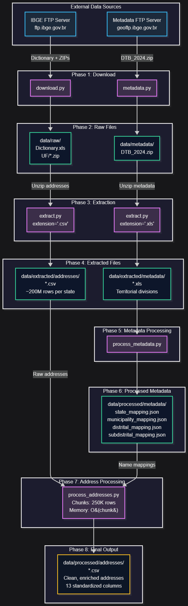

# CNEFE Pipeline - Refactoring Guide

This document provides a complete map of data flows, dependencies, critical paths, edge cases, and features that must be preserved during refactoring.

---

## Table of Contents
1. [Data Flow Diagram](#data-flow-diagram)
2. [Module Dependencies](#module-dependencies)
3. [Critical Paths](#critical-paths)
4. [Edge Cases](#edge-cases)
5. [Features to Preserve](#features-to-preserve)
6. [Refactoring Safety Checklist](#refactoring-safety-checklist)

---

## Data Flow Diagram



### Data Flow Steps

1. **Download Phase**
   - Source: `ftp.ibge.gov.br`
   - Downloads: Dictionary XLS + State ZIP files
   - Output: `data/raw/`

2. **Extract Addresses Phase**
   - Source: `data/raw/*.zip`
   - Extracts: Only `.csv` files
   - Output: `data/extracted/addresses/`

3. **Download Metadata Phase**
   - Source: `geoftp.ibge.gov.br`
   - Downloads: Territorial division data (DTB_2024.zip)
   - Output: `data/metadata/`

4. **Extract Metadata Phase**
   - Source: `data/metadata/DTB_2024.zip`
   - Extracts: Only `.xls` files
   - Output: `data/extracted/metadata/`

5. **Process Metadata Phase**
   - Source: `data/extracted/metadata/*.xls`
   - Creates: 4 JSON mapping files
   - Output: `data/processed/metadata/`

6. **Process Addresses Phase**
   - Source: `data/extracted/addresses/*.csv` + `data/processed/metadata/*.json`
   - Processes: Applies mappings, transforms columns
   - Output: `data/processed/addresses/`

---

## Module Dependencies

### Dependency Graph

```
scripts/download.py
    │
    ├─ External: ftplib.FTP
    ├─ External: tqdm
    └─ No internal dependencies

scripts/metadata.py
    │
    ├─ External: ftplib.FTP
    └─ No internal dependencies

scripts/extract.py
    │
    ├─ External: zipfile
    └─ No internal dependencies

scripts/process_metadata.py
    │
    ├─ External: pandas
    ├─ External: openpyxl (via pandas)
    ├─ External: xlrd (via pandas)
    └─ Depends on: extract.py output

scripts/process_addresses.py
    │
    ├─ External: pandas
    ├─ External: tqdm
    ├─ Depends on: extract.py output (addresses)
    └─ Depends on: process_metadata.py output (mappings)
```

### External Dependencies

**Network:**
- `ftp.ibge.gov.br` - Census address data
- `geoftp.ibge.gov.br` - Territorial metadata

**Python Libraries:**
- `pandas>=2.3.2` - Data processing
- `openpyxl>=3.1.5` - Excel file reading (xlsx)
- `xlrd>=2.0.2` - Excel file reading (xls)
- `tqdm>=4.67.1` - Progress bars

### File System Dependencies

**Critical Paths:**
```
data/
├── raw/                          # download.py output
│   ├── Dicionario_CNEFE_Censo_2022.xls
│   └── UF/*.zip
├── metadata/                     # metadata.py output
│   └── DTB_2024.zip
├── extracted/
│   ├── addresses/                # extract.py output (addresses)
│   │   └── *.csv
│   └── metadata/                 # extract.py output (metadata)
│       └── *.xls
└── processed/
    ├── metadata/                 # process_metadata.py output
    │   ├── state_mapping.json
    │   ├── municipality_mapping.json
    │   ├── distrital_mapping.json
    │   └── subdistrital_mapping.json
    └── addresses/                # process_addresses.py output
        └── *.csv
```

### Execution Order Requirements

**Hard Dependencies (Must be sequential):**
1. `download.py` → `extract.py` (addresses)
2. `metadata.py` → `extract.py` (metadata)
3. `extract.py` (metadata) → `process_metadata.py`
4. `process_metadata.py` → `process_addresses.py`
5. `extract.py` (addresses) → `process_addresses.py`

**Parallel Opportunities:**
- `download.py` can run parallel with `metadata.py`
- `extract.py` (addresses) can run parallel with metadata processing pipeline

---

## Critical Paths

### Critical Path 1: Address Data Integrity

**Path**: Raw CSV → Processed CSV

**Critical Points:**
1. **Column Selection** (`process_addresses.py::COLUMNS`)
   - Must include all 15 required columns
   - Order doesn't matter for input
   - Missing column = pipeline failure

2. **Data Type Enforcement** (`process_addresses.py::DTYPES`)
   - Codes must be strings (not integers)
   - Coordinates must be floats
   - Wrong types = mapping failures

3. **Mapping Application**
   - All 4 mappings must be loaded successfully
   - Missing mapping file = crash
   - Missing key in mapping = NaN in output

4. **Special Value Handling**
   - `DSC_MODIFICADOR == "SN"` → must replace number
   - Failure = incorrect address numbers

### Critical Path 2: Metadata Pipeline

**Path**: Excel Metadata → JSON Mappings → Applied to Addresses

**Critical Points:**
1. **Excel Reading** (`process_metadata.py::HEADER_POS`)
   - Must skip exactly 6 rows
   - Wrong offset = wrong column names = failed mappings

2. **Column Name Matching**
   - Exact column names required:
     - `"UF"`, `"Nome_UF"`
     - `"Código Município Completo"`, `"Nome_Município"`
     - etc.
   - Typo in column name = KeyError

3. **Duplicate Removal**
   - Must deduplicate before creating mappings
   - Skip deduplication = arbitrary value chosen for duplicates

4. **JSON Serialization**
   - Must use `ensure_ascii=False`
   - Must use UTF-8 encoding
   - Wrong encoding = garbled Portuguese characters

### Critical Path 3: File Discovery

**Path**: Downloaded Files → Extracted Files → Processed Files

**Critical Points:**
1. **Recursive File Search**
   - Uses `.rglob()` to find files
   - Searches all subdirectories
   - Must handle nested directory structures

2. **Extension Filtering**
   - Case-insensitive comparison
   - Exact match on extension (including dot)
   - `.CSV` matches `.csv` matches `.Csv`

3. **Duplicate Detection**
   - Checks by filename only (not path)
   - `file.csv` in any subdirectory is considered duplicate
   - Can skip valid files if names collide

### Critical Path 4: Chunk Processing

**Path**: Large CSV → Memory-Safe Processing → Complete Output

**Critical Points:**
1. **Chunk Size** (`process_addresses.py::CHUNKSIZE = 250_000`)
   - Too large = memory issues
   - Too small = performance degradation
   - Must balance memory vs. speed

2. **Header Writing**
   - First chunk: write headers
   - Subsequent chunks: append without headers
   - Wrong mode = duplicate headers or no headers

3. **File Handle Management**
   - Opens output file multiple times
   - Must append correctly
   - File corruption if interrupted mid-chunk

---

## Edge Cases

### Edge Case 1: Missing Address Number

**Scenario**: Address without a number (common in Brazil)

**Input:**
```csv
NUM_ENDERECO,DSC_MODIFICADOR
100,SN
```

**Expected Behavior:**
```csv
NUMERO
SN
```

**Critical Rule**: When `DSC_MODIFICADOR == "SN"`, always replace `NUM_ENDERECO` with `"SN"`

**Test Coverage**: ✅ `test_process_addresses.py::test_main_characterization`

---

### Edge Case 2: Partial Complement Data

**Scenario**: Address has element name but no value, or vice versa

**Input:**
```csv
NOM_COMP_ELEM1,VAL_COMP_ELEM1
A,X              # Both present
B,               # Only name
,Y               # Only value
,                # Both empty
```

**Expected Behavior:**
```csv
COMPLEMENTO
A X
B
Y
(empty string)
```

**Critical Rule**: Fill nulls with empty strings, join with space, normalize whitespace

**Test Coverage**: ✅ `test_process_addresses.py::test_main_characterization`

---

### Edge Case 3: Duplicate Filenames in Different Directories

**Scenario**: Same filename exists in multiple subdirectories

**Input:**
```
source/
├── SP/addresses.csv
└── RJ/addresses.csv
```

**Current Behavior**: Only first file is extracted (second is skipped as "duplicate")

**Critical Rule**: Duplicate detection is by filename only, not full path

**Implications for Refactoring**:
- May want to preserve directory structure
- Or rename files to avoid collisions
- Current behavior prevents re-extraction

**Test Coverage**: ❌ Not explicitly tested

---

### Edge Case 4: Corrupted ZIP Files

**Scenario**: Downloaded ZIP file is incomplete or corrupted

**Current Behavior**:
- Catches `BadZipFile` exception
- Prints error message
- Continues processing other files

**Critical Rule**: Single corrupted file doesn't stop entire pipeline

**Test Coverage**: ❌ Not explicitly tested (mentioned in code)

---

### Edge Case 5: Missing Mapping Keys

**Scenario**: CSV contains code not present in mapping JSON

**Input CSV:**
```csv
COD_UF
99
```

**Input Mapping:**
```json
{"11": "Rondônia", "12": "Acre"}
```

**Current Behavior**: Results in `NaN` in output column

**Critical Rule**: Missing keys produce `NaN`, not errors

**Implications**: Silent data loss possible

**Test Coverage**: ❌ Not explicitly tested

---

### Edge Case 6: Empty CSV Files

**Scenario**: Extracted CSV has headers but no data rows

**Current Behavior**: Creates output file with headers only

**Critical Rule**: Empty files are processed normally (no errors)

**Test Coverage**: ❌ Not explicitly tested

---

### Edge Case 7: Very Large Files

**Scenario**: CSV file exceeds available memory

**Current Behavior**: Chunk processing prevents memory issues

**Critical Rule**: CHUNKSIZE must be respected to handle files of any size

**Memory Usage**: O(CHUNKSIZE) not O(file_size)

**Test Coverage**: ⚠️ Indirectly tested (chunking verified, not large files)

---

### Edge Case 8: FTP Connection Interruption

**Scenario**: Network drops during download

**Current Behavior**:
- Partial file is written
- Next run: file exists, skipped
- Result: Corrupted data not re-downloaded

**Critical Rule**: No resume capability, no integrity checks

**Implications**: May need manual cleanup after network failures

**Test Coverage**: ❌ Not tested

---

### Edge Case 9: Already Extracted Files

**Scenario**: Extract script re-run with existing files

**Current Behavior**: Skips files that already exist (by filename)

**Critical Rule**: Idempotent extraction (safe to re-run)

**Benefit**: Allows resume after interruption

**Test Coverage**: ✅ Verified in extract tests

---

### Edge Case 10: Non-CSV Files in ZIP

**Scenario**: ZIP contains .txt, .pdf, and .csv files

**Current Behavior**: Only extracts files matching extension parameter

**Critical Rule**: Extension filter is mandatory and enforced

**Test Coverage**: ✅ `test_extract_file.py::test_main_extraction_real_zip`

---

## Features to Preserve

### Feature 1: Idempotency

**Description**: Pipeline can be safely re-run without duplicating work

**Current Implementation**:
- `download.py`: Checks if file exists before downloading
- `extract.py`: Checks if file exists before extracting

**Why Critical**: Allows resume after failures, saves bandwidth/time

**Preservation Requirements**:
- Maintain filename-based duplicate detection
- Keep "skip if exists" logic
- Document that partial files may cause issues

**Test Verification**: Re-run tests should pass without changes

---

### Feature 2: Memory-Efficient Processing

**Description**: Can process arbitrarily large CSV files without memory issues

**Current Implementation**:
- Chunk-based reading (250,000 rows per chunk)
- Incremental writing to output files
- No full-file-in-memory operations

**Why Critical**: Brazilian census data is massive (millions of addresses per state)

**Preservation Requirements**:
- Maintain chunked processing architecture
- Keep CHUNKSIZE configurable
- Ensure incremental write mode preserved

**Test Verification**: Memory profiling tests (not currently implemented)

---

### Feature 3: Progress Tracking

**Description**: Visual feedback during long-running operations

**Current Implementation**:
- `tqdm` progress bars in download.py
- Nested progress bars (overall + per-file)
- Chunk-level progress in process_addresses.py

**Why Critical**: User experience during hours-long processing

**Preservation Requirements**:
- Keep tqdm integration
- Maintain nested progress structure
- Preserve descriptive messages

**Test Verification**: Can be tested with captured stdout

---

### Feature 4: Territorial Name Mapping

**Description**: Converts numeric codes to human-readable names

**Current Implementation**:
- JSON mapping files for UF, municipality, district, subdistrict
- Simple dict.map() operation in pandas

**Why Critical**: Core business logic - makes data usable

**Preservation Requirements**:
- Maintain 4 separate mapping files
- Keep UTF-8 encoding with Portuguese characters
- Preserve mapping order (state → municipality → district → subdistrict)

**Test Verification**: ✅ Fully tested in process_addresses tests

---

### Feature 5: Complement Field Construction

**Description**: Intelligently combines address complement elements

**Current Implementation**:
```python
df["COMPLEMENTO"] = (
    df[["NOM_COMP_ELEM1", "VAL_COMP_ELEM1"]]
    .fillna("")
    .astype(str)
    .agg(" ".join, axis=1)
    .str.split()
    .str.join(" ")
)
```

**Why Critical**: Produces clean, standardized complement strings

**Preservation Requirements**:
- Keep fillna("") behavior
- Maintain whitespace normalization
- Preserve join logic

**Test Verification**: ✅ Tested with multiple scenarios

---

### Feature 6: "Sem Número" (SN) Handling

**Description**: Brazilian addresses often lack numbers - special handling required

**Current Implementation**:
```python
df.loc[df["DSC_MODIFICADOR"] == "SN", "NUM_ENDERECO"] = "SN"
```

**Why Critical**: Domain-specific business rule for Brazilian addresses

**Preservation Requirements**:
- Exact string match on "SN"
- Replaces original number value
- Must happen before output

**Test Verification**: ✅ Tested explicitly

---

### Feature 7: Column Standardization

**Description**: Transforms raw IBGE column names to clean, user-friendly names

**Current Implementation**:
```python
{
    "COD_UNICO_ENDERECO": "ID_ENDERECO",
    "DSC_LOCALIDADE": "BAIRRO",
    "NOM_SEGLOGR": "RUA",
    # etc.
}
```

**Why Critical**: API contract for downstream consumers

**Preservation Requirements**:
- Maintain exact output column names
- Keep column order consistent
- Preserve all 13 output columns

**Test Verification**: ✅ Column presence tested

---

### Feature 8: Extension-Based Extraction

**Description**: Selectively extracts files from ZIPs based on extension

**Current Implementation**:
- Case-insensitive extension matching
- Filters file list before extraction
- Different extensions for addresses vs. metadata

**Why Critical**: Prevents extracting unnecessary files (reduces disk usage)

**Preservation Requirements**:
- Keep extension parameter mandatory
- Maintain case-insensitive comparison
- Preserve filter-then-extract pattern

**Test Verification**: ✅ Tested with .txt vs .csv

---

### Feature 9: Recursive File Discovery

**Description**: Finds files in nested directory structures

**Current Implementation**:
- Uses `.rglob("*.zip")` and `.rglob("*.csv")`
- Searches all subdirectories
- No depth limit

**Why Critical**: Handles IBGE's nested folder structure (UF/state/files)

**Preservation Requirements**:
- Keep recursive search
- Maintain glob patterns
- Preserve automatic directory traversal

**Test Verification**: ⚠️ Partially tested

---

### Feature 10: Duplicate Row Removal in Metadata

**Description**: Ensures mapping files contain unique entries only

**Current Implementation**:
```python
df.drop_duplicates()
```

**Why Critical**: Prevents arbitrary values in mappings when duplicates exist

**Preservation Requirements**:
- Must deduplicate before creating dict
- Keep pandas drop_duplicates behavior
- Apply to all 4 mapping types

**Test Verification**: ⚠️ Implicitly tested

---

### Feature 11: CSV Separator Handling

**Description**: Uses semicolon separator for IBGE CSV format

**Current Implementation**:
```python
pd.read_csv(filepath, sep=";", ...)
```

**Why Critical**: IBGE uses semicolon, not comma (Portuguese standard)

**Preservation Requirements**:
- Keep `sep=";"` parameter
- Don't assume comma-separated
- Document this quirk

**Test Verification**: ✅ Tests use semicolon

---

### Feature 12: Encoding Consistency

**Description**: UTF-8 encoding throughout pipeline

**Current Implementation**:
- JSON files: `encoding="utf-8"`, `ensure_ascii=False`
- Excel files: pandas default (UTF-8)
- CSV files: pandas default (UTF-8)

**Why Critical**: Portuguese characters (ç, ã, õ, etc.) must render correctly

**Preservation Requirements**:
- Maintain UTF-8 everywhere
- Keep `ensure_ascii=False` in JSON
- Test with Portuguese characters

**Test Verification**: ⚠️ Character encoding not explicitly tested
